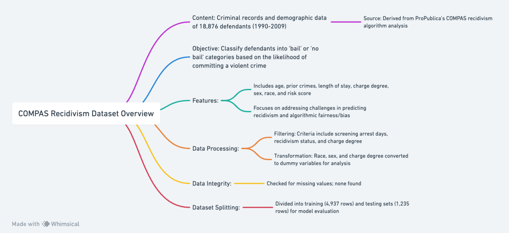
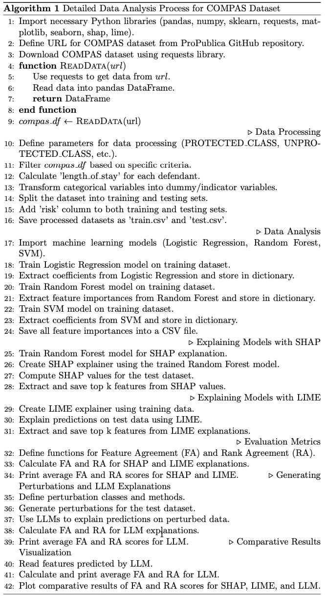

# Data Query, Processing and Analysis Process

## Overview
This document outlines the process used in `Data_Query.ipynb`, `Data_Processing.ipynb`  and `Data_Analysis.ipynb` files for querying, processing, and analyzing the COMPAS (Correctional Offender Management Profiling for Alternative Sanctions) dataset. The dataset contains criminal records and demographic features for defendants and is used to predict recidivism risk.

## Data Query

### Preliminary Steps
- Install necessary packages: `json`, `pandas`, `numpy`, `sklearn`, `requests`, `StringIO`.
- Query data from the source: [COMPAS Dataset](https://raw.githubusercontent.com/propublica/compas-analysis/master/compas-scores-two-years.csv).

### Query Process
- Download the COMPAS dataset using the provided GitHub URL.
- Read the downloaded data into a pandas DataFrame.
- Perform initial data inspection using `head()`, `tail()`, `dtypes`, and `info()` methods.
- Output the queried data to a CSV file named 'compas.csv'.

## Data Processing

### Preliminary Steps
- Similar package installations and data import steps as in the data query phase.

### Processing Steps
- Define parameters for data processing, including classes for outcomes.
- Filter the dataset based on specific criteria like days between screening arrest and recidivism status.
- Calculate the length of stay for each defendant.
- Select relevant columns and transform categorical variables into dummy/indicator variables.
- Split the dataset into training and testing sets.
- Add a 'risk' column and save the datasets as 'train.csv' and 'test.csv'.
- Check for missing values and output the number of high-risk cases.
- Perform exploratory data analysis using `matplotlib` and `seaborn` for visualizations.

## Data Analysis

### Machine Learning Modeling
- Implement Logistic Regression, Random Forest, and Support Vector Machine models.
- Store feature importance from each model into a CSV file.

### Explaining Machine Learning Models with SHAP & LIME
- Use SHAP and LIME to explain model predictions and extract the top k most important features.
- Save the extracted features to CSV files.

### Building Evaluation Metrics
- Define functions for calculating Feature Agreement (FA) and Rank Agreement (RA).
- Calculate FA and RA for SHAP, LIME, and Logistic Regression Model (LLM) predictions.

### Creating Perturbation Samples
- Implement classes for perturbation methods and generate perturbations.
- Use perturbed data to generate explanations using Large Language Models (LLMs).

### Comparative Results
- Plot comparative results of FA and RA scores using `matplotlib` and `seaborn`.
- Perform additional LIME analysis for varying numbers of samples and features.
- Calculate and plot FA and RA scores for varying sample sizes.

## Flowchart for Data Query, Processing and Analysis Process



## Pseudo-Code for Data Query, Processing and Analysis Process


```latex
\documentclass{article}
\usepackage{algorithm}
\usepackage{algpseudocode}

\begin{document}
\begin{algorithm}
\caption{Detailed Data Analysis Process for COMPAS Dataset}\label{alg:compas_analysis}
\begin{algorithmic}[1]

\State Import necessary Python libraries (pandas, numpy, sklearn, requests, matplotlib, seaborn, shap, lime).
\State Define URL for COMPAS dataset from ProPublica GitHub repository.
\State Download COMPAS dataset using requests library.

\Function{ReadData}{$url$}
    \State Use requests to get data from $url$.
    \State Read data into pandas DataFrame.
    \State \Return DataFrame
\EndFunction

\State $compas\_df \gets$ \Call{ReadData}{url}

\Comment{Data Processing}
\State Define parameters for data processing (PROTECTED\_CLASS, UNPROTECTED\_CLASS, etc.).
\State Filter $compas\_df$ based on specific criteria.
\State Calculate 'length\_of\_stay' for each defendant.
\State Transform categorical variables into dummy/indicator variables.
\State Split the dataset into training and testing sets.
\State Add 'risk' column to both training and testing sets.
\State Save processed datasets as 'train.csv' and 'test.csv'.

\Comment{Data Analysis}
\State Import machine learning models (Logistic Regression, Random Forest, SVM).
\State Train Logistic Regression model on training dataset.
\State Extract coefficients from Logistic Regression and store in dictionary.
\State Train Random Forest model on training dataset.
\State Extract feature importances from Random Forest and store in dictionary.
\State Train SVM model on training dataset.
\State Extract coefficients from SVM and store in dictionary.
\State Save all feature importances into a CSV file.

\Comment{Explaining Models with SHAP}
\State Train Random Forest model for SHAP explanation.
\State Create SHAP explainer using the trained Random Forest model.
\State Compute SHAP values for the test dataset.
\State Extract and save top k features from SHAP values.

\Comment{Explaining Models with LIME}
\State Create LIME explainer using training data.
\State Explain predictions on test data using LIME.
\State Extract and save top k features from LIME explanations.

\Comment{Evaluation Metrics}
\State Define functions for Feature Agreement (FA) and Rank Agreement (RA).
\State Calculate FA and RA for SHAP and LIME explanations.
\State Print average FA and RA scores for SHAP and LIME.
\Comment{Generating Perturbations and LLM Explanations}
\State Define perturbation classes and methods.
\State Generate perturbations for the test dataset.
\State Use LLMs to explain predictions on perturbed data.
\State Calculate FA and RA for LLM explanations.
\State Print average FA and RA scores for LLM.
\Comment{Comparative Results Visualization}
\State Read features predicted by LLM.
\State Calculate and print average FA and RA for LLM.
\State Plot comparative results of FA and RA scores for SHAP, LIME, and LLM.
\end{algorithmic}
\end{algorithm}
\end{document}
