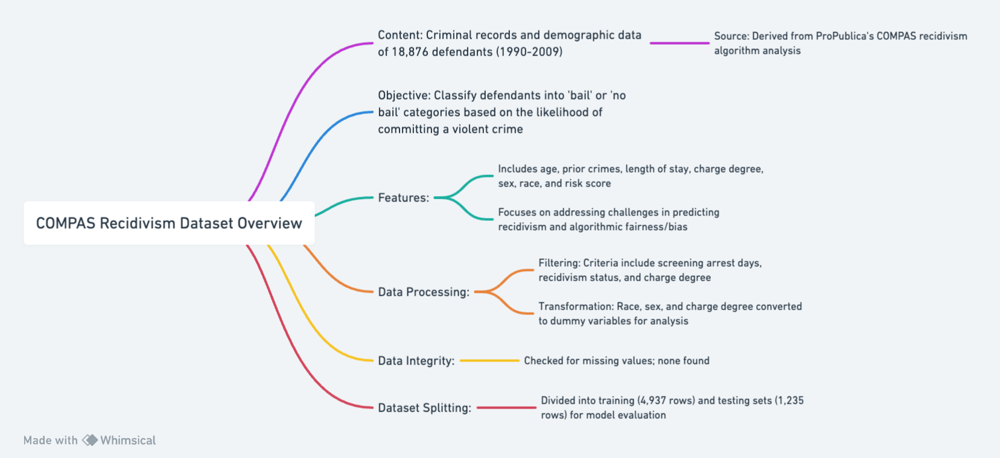

# Data Description

This dataset contains criminal records and demographic features for 18,876 defendants who were released on bail in U.S. state courts from 1990 to 2009. The dataset is derived from the COMPAS recidivism algorithm analysis conducted by ProPublica. The primary task is to classify defendants into two categories: bail (unlikely to commit a violent crime if released) and no bail (likely to commit a violent crime if released).

The dataset includes features such as age, prior count of crimes, length of stay, charge degree, sex, race, and a risk assessment score. The data highlights the challenge of predicting recidivism and raises important questions about fairness and bias in algorithmic decision-making.

# Data Processing and Enhancement

## Data Filtering and Feature Transformation
- **Data Filtering:** The dataset has been filtered based on specific criteria such as days between screening arrest, recidivism status, and charge degree.
- **Feature Transformation:** Categorical variables like race, sex, and charge degree have been transformed into dummy/indicator variables for analytical modeling.
- **Missing Values:** The dataset has been checked for missing values to ensure data integrity and quality. No missing values were found.

## Dataset Splitting
- **Training and Testing Sets:** The dataset has been split into training and testing sets to evaluate the model's performance. The training set includes 4,937 rows, and the testing set includes 1,235 rows.

# Data Dictionary

| Variable          | Description                                                                 | Type         | Range/Values      |
|-------------------|-----------------------------------------------------------------------------|--------------|-------------------|
| age               | Age of the defendant                                                         | Numerical    | Continuous        |
| priors_count      | Number of prior crimes committed by the defendant                           | Numerical    | Continuous        |
| length_of_stay    | Length of stay in days                                                       | Numerical    | Continuous        |
| c_charge_degree_F | Indicator of charge degree (F: Felony)                                       | Categorical  | 0 (No), 1 (Yes)   |
| sex_Female        | Indicator of defendant's sex (Female)                                       | Categorical  | 0 (Male), 1 (Female) |
| race              | Race of the defendant (transformed into a binary indicator)                  | Categorical  | 0, 1              |
| risk              | Risk assessment score (0: low risk, 1: high risk)                            | Categorical  | 0, 1              |

# Sample Data

**Training Set:**

| age | priors_count | length_of_stay | c_charge_degree_F | sex_Female | race | risk |
|-----|--------------|----------------|-------------------|------------|------|------|
| 40  | 0            | 4              | 1                 | 0          | 1    | 0    |
| 39  | 0            | 0              | 0                 | 0          | 0    | 1    |
| 46  | 0            | 37             | 0                 | 0          | 0    | 1    |
| ... | ...          | ...            | ...               | ...        | ...  | ...  |

**Testing Set:**

| age | priors_count | length_of_stay | c_charge_degree_F | sex_Female | race | risk |
|-----|--------------|----------------|-------------------|------------|------|------|
| 34  | 0            | 241            | 1                 | 0          | 1    | 1    |
| 61  | 0            | 1              | 1                 | 1          | 0    | 1    |
| 24  | 5            | 6              | 1                 | 0          | 1    | 0    |
| ... | ...          | ...            | ...               | ...        | ...  | ...  |

# Flowchart of Dataset Structure


# Reference

ProPublica. How we analyzed the compas recidivism algorithm. https://www.propublica.org/article/how-we-analyzed-the-compas-recidivism-algorithm. Accessed: 2023-12-1.

```bibtex
@misc{ProPublica2016,
  title={How we analyzed the COMPAS recidivism algorithm},
  author={ProPublica},
  year={2016},
  howpublished={\url{https://www.propublica.org/article/how-we-analyzed-the-compas-recidivism-algorithm}},
  note={Accessed: 2023-12-1}
}

