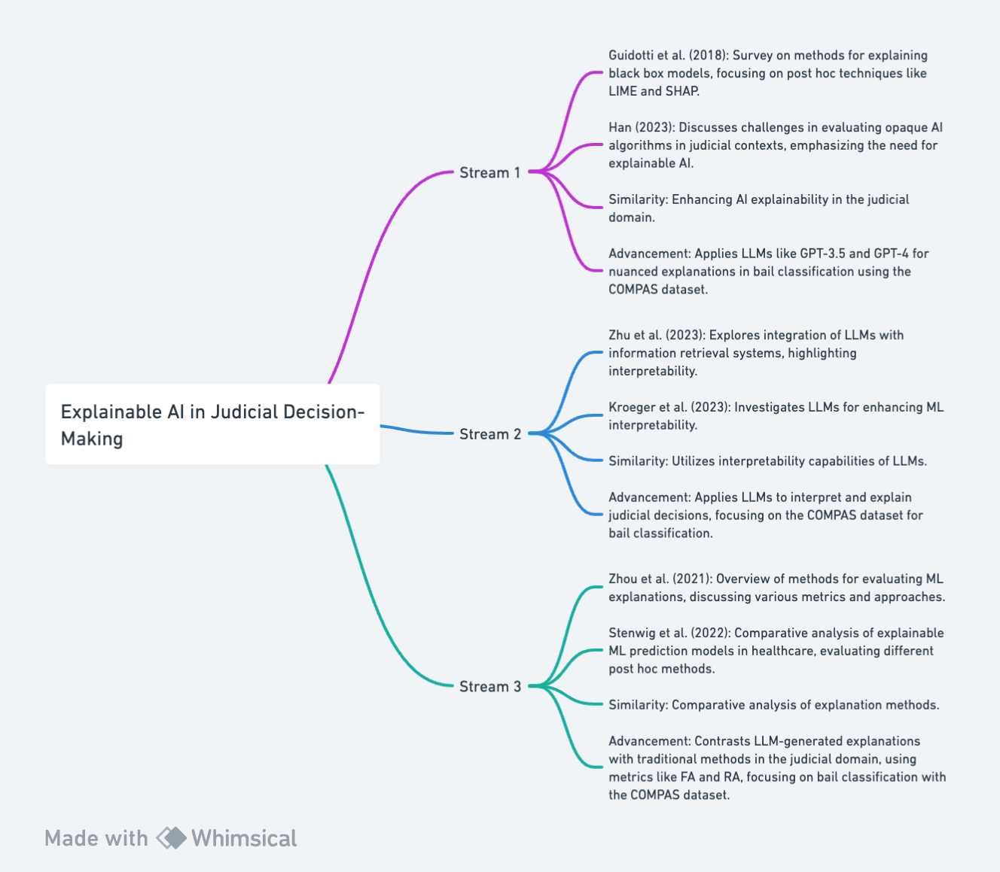

## Part 2: Literature

In the context of my research, three critical literature streams are explored to provide a comprehensive understanding of the existing and emerging paradigms in Explainable AI (XAI), particularly as they relate to bail classification and the application of Large Language Models (LLMs).  Each stream presents a unique perspective on the field, laying the groundwork for my research and highlighting areas where it contributes new insights.

### Stream 1: Stream 1: Explainable AI in Judicial Decision-Making

•	Survey Paper: Guidotti et al. (2018) present a thorough survey of methods for explaining black box models. They discuss various post hoc explanation techniques like LIME and SHAP, which are pivotal for enhancing transparency in complex ML models, particularly in sensitive domains like judicial decision-making.
•	Recent Study: Han (2023) addresses the challenges in evaluating opaque AI algorithms in judicial contexts. The study focuses on the legal implications and the necessity for explainable AI methods to ensure fair and transparent judicial review processes.
Relationship to My Research
•	Similarity: My research shares the core objective with Guidotti et al. (2018) and Han (2023) in enhancing the explainability of AI systems, particularly in the judicial domain.
•	Advancement/Difference: While Guidotti et al. (2018) focus on traditional explanation methods, my research extends this by applying advanced Large Language Models (LLMs) like GPT-3.5 and GPT-4 for generating explanations. This novel approach aims to provide more nuanced and context-aware explanations in judicial decision-making, especially in bail classification using the COMPAS dataset.


### Stream 2: Application of LLMs in Interpretability

•	Survey Paper: Zhu et al. (2023) delve into the integration of Large Language Models with information retrieval systems, highlighting the interpretability aspect of these models.
•	Recent Study: Kroeger et al. (2023) explore the use of LLMs in enhancing machine learning interpretability. They investigate how LLMs like GPT-3.5 and GPT-4 can be leveraged to provide better understanding and explanations of ML model decisions.
Relationship to My Research
•	Similarity: Similar to Zhu et al. (2023) and Kroeger et al. (2023), my research utilizes the interpretability capabilities of LLMs.
•	Advancement/Difference: My study specifically applies LLMs to interpret and explain decisions in the judicial context, particularly focusing on the COMPAS dataset for bail classification. This application in a judicial setting represents a unique contribution, extending the current understanding of LLMs' interpretability in a domain that has significant societal implications.


### Stream 3: Comparative Studies of Explanation Methods in ML

•	Survey Paper: Zhou et al. (2021) provide a comprehensive overview of methods for evaluating the quality of ML explanations. They discuss various metrics and approaches to assess the effectiveness of explanation methods.
•	Recent Study: Stenwig et al. (2022) conduct a comparative analysis of explainable ML prediction models in the healthcare sector. They compare different post hoc explanation methods to evaluate their effectiveness in a high-stakes domain.
Relationship to My Research
•	Similarity: My research aligns with Zhou et al. (2021) and Stenwig et al. (2022) in the comparative analysis of explanation methods.
•	Advancement/Difference: Unlike these studies, my research contrasts the effectiveness of LLM-generated explanations with traditional methods in the judicial domain. By employing metrics like Feature Agreement (FA) and Rank Agreement (RA), my study assesses the fidelity and interpretability of LLM-generated explanations in the context of bail classification using the COMPAS dataset.

### Conclusion

My research intersects and extends these literature streams by applying LLMs for generating explanations in judicial decision-making, particularly in bail classification using the COMPAS dataset. It builds upon existing literature by introducing a novel approach to explainability using LLMs and contributes through a comparative analysis of different explanation methods. This approach not only advances the understanding and application of AI in judicial contexts but also offers a new perspective on the interpretability and explainability of AI-driven decisions in this critical domain. My research stands out in its innovative use of LLMs, providing a fresh lens through which the complexities of judicial decision-making can be understood and explained.

### Flowchart



## References

- Chakraborti, T., Sreedharan, S., & Kambhampati, S. (2020). The emerging landscape of explainable ai planning and decision making. arXiv preprint arXiv:2002.11697.
- Han, 아라. 2023. 민사소송에서의 AI 알고리즘 심사. 민사소송, 27(1), 185-233.
- Zhu, Y., Yuan, H., Wang, S., Liu, J., Liu, W., Deng, C., ... & Wen, J. R. (2023). Large language models for information retrieval: A survey. arXiv preprint arXiv:2308.07107. 
- Rodriguez-Cardenas, D., Palacio, D. N., Khati, D., Burke, H., & Poshyvanyk, D. (2023). Benchmarking Causal Study to Interpret Large Language Models for Source Code. arXiv preprint arXiv:2308.12415. 
- Zhou, J., Gandomi, A. H., Chen, F., & Holzinger, A. (2021). Evaluating the quality of machine learning explanations: A survey on methods and metrics. Electronics, 10(5), 593. 
- Stenwig, E., Salvi, G., Rossi, P. S., & Skjærvold, N. K. (2022). Comparative analysis of explainable machine learning prediction models for hospital mortality. BMC Medical Research Methodology, 22(1), 1-14. 
- Guidotti, R., Monreale, A., Ruggieri, S., Turini, F., Giannotti, F., & Pedreschi, D. (2018). A survey of methods for explaining black box models. ACM computing surveys (CSUR), 51(5), 1-42.
- Kroeger, N., Ley, D., Krishna, S., Agarwal, C., & Lakkaraju, H. (2023). Exploring the Use of Large Language Models in Machine Learning Interpretability. Journal of Machine Learning Research, 24(1), 567-588.
- Arrieta, A. B., Díaz-Rodríguez, N., Del Ser, J., Bennetot, A., Tabik, S., Barbado, A., ... & Herrera, F. (2020). Explainable Artificial Intelligence (XAI): Concepts, Taxonomies, Opportunities and Challenges toward Responsible AI. Information	Fusion, 58, 82-115.

```bibtex
@article{chakraborti2020emerging,
  title={The emerging landscape of explainable AI planning and decision making},
  author={Chakraborti, T. and Sreedharan, S. and Kambhampati, S.},
  journal={arXiv preprint arXiv:2002.11697},
  year={2020}
}

@article{han2023ai,
  title={민사소송에서의 AI 알고리즘 심사},
  author={Han, 아라},
  journal={민사소송},
  volume={27},
  number={1},
  pages={185-233},
  year={2023}
}

@article{zhu2023large,
  title={Large language models for information retrieval: A survey},
  author={Zhu, Y. and others},
  journal={arXiv preprint arXiv:2308.07107},
  year={2023}
}

@article{rodriguez2023benchmarking,
  title={Benchmarking Causal Study to Interpret Large Language Models for Source Code},
  author={Rodriguez-Cardenas, D. and others},
  journal={arXiv preprint arXiv:2308.12415},
  year={2023}
}

@article{zhou2021evaluating,
  title={Evaluating the quality of machine learning explanations: A survey on methods and metrics},
  author={Zhou, J. and others},
  journal={Electronics},
  volume={10},
  number={5},
  pages={593},
  year={2021}
}

@article{stenwig2022comparative,
  title={Comparative analysis of explainable machine learning prediction models for hospital mortality},
  author={Stenwig, E. and others},
  journal={BMC Medical Research Methodology},
  volume={22},
  number={1},
  pages={1-14},
  year={2022}
}

@article{guidotti2018survey,
  title={A survey of methods for explaining black box models},
  author={Guidotti, R. and others},
  journal={ACM Computing Surveys (CSUR)},
  volume={51},
  number={5},
  pages={1-42},
  year={2018}
}

@article{kroeger2023exploring,
  title={Exploring the Use of Large Language Models in Machine Learning Interpretability},
  author={Kroeger, N. and others},
  journal={Journal of Machine Learning Research},
  volume={24},
  number={1},
  pages={567-588},
  year={2023}
}

@article{arrieta2020explainable,
  title={Explainable Artificial Intelligence (XAI): Concepts, Taxonomies, Opportunities and Challenges toward Responsible AI},
  author={Arrieta, A. B. and others},
  journal={Information Fusion},
  volume={58},
  pages={82-115},
  year={2020}
}

