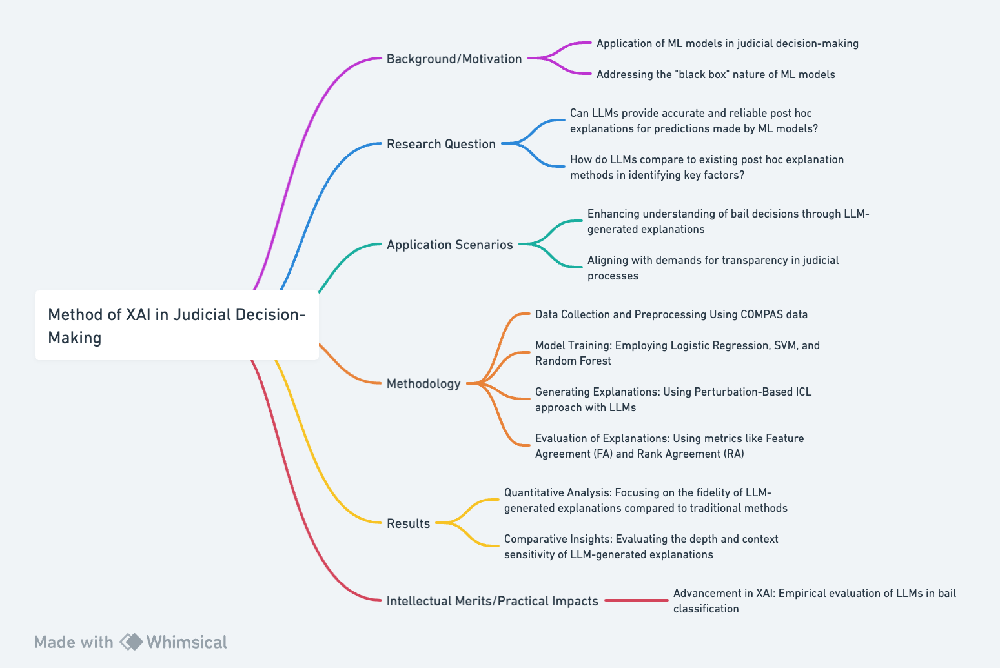

# Part III: Method

- In Part III of my research, I delve into the methodology of how we can utilize Large Language Models (LLMs) for explainable AI (XAI) in the context of judicial decision-making, particularly in bail classification. This segment addresses the critical steps and components involved in the research process, from the conceptual background and motivation to the practical application scenarios, data processing, model training, explanation generation, and evaluation methods. The focus here is on outlining the specific approaches and techniques that will be employed to assess the effectiveness of LLMs in providing interpretable and meaningful explanations for machine learning models in the judicial sector.


## Background/Motivation:
- The application of machine learning (ML) models in judicial decision-making, particularly in bail classification, is increasingly prevalent. The use of tools like the COMPAS dataset has sparked significant debate regarding the transparency and interpretability of these models, often labeled as "black boxes." This opacity raises critical concerns in judicial fairness and decision-making (Guidotti et al., 2018). The growing demand for explainable AI (XAI) in this field is driven by societal and regulatory pressures for more transparent decision-making processes in ML models (Arrieta et al., 2020). The advent of Large Language Models (LLMs) such as GPT-3.5 and GPT-4, renowned for their advanced in-context learning (ICL) capabilities, presents a promising path for generating transparent post hoc explanations (Liu et al., 2023). This research investigates the potential of LLMs in elucidating the decision-making process in bail classification, a crucial aspect of the judicial system.

## Research Question:
- Can LLMs provide accurate and reliable post hoc explanations for predictions made by ML models in the context of bail classification using the COMPAS dataset?
- How do LLMs compare to existing post hoc explanation methods in identifying key factors influencing bail classification decisions?

## Application Scenarios:
### Judicial Decision-Making: 
Utilizing LLM-generated explanations in bail classification could significantly impact the judicial system. Courts can use these advanced explanations to better understand the factors influencing bail decisions, leading to more equitable and informed rulings.
### Regulatory Compliance and Transparency: 
In the context of increasing scrutiny over automated decision-making in the legal system, LLMs' ability to offer clear, comprehensive explanations is invaluable. This aligns with the growing demands for transparency in judicial processes. Courts and legal institutions can leverage these explanations to demonstrate adherence to legal standards and ethical guidelines, which mandate explainability in automated decision-making.

## Methodology:
### Data Collection and Preprocessing: 
-	Dataset: Utilizing the COMPAS recidivism risk score data and analysis provided by ProPublica (2016), this study will involve extensive preprocessing to adapt the data for ML model training and explanation generation.
- Preprocessing Steps: The steps will include normalization, handling missing values, and ensuring that the data is suitable for both ML model training and subsequent explanation generation using Large Language Models (LLMs).

### Model Training: 
-	ML Classifiers: The study will employ three widely used ML classifiers: Logistic Regression, Support Vector Machine (SVM), and Random Forest, trained on the preprocessed COMPAS dataset. These models represent diverse learning algorithms, providing a comprehensive basis for evaluating LLM explanations (Guidotti et al., 2018).
-	Motivation: The choice of these models is motivated by their diverse nature, representing different learning algorithms (linear, kernel-based, and ensemble methods), providing a comprehensive basis for evaluating the LLM explanations.

### Generating Explanations using Perturbation-Based ICL: 
- Approach: Following the Perturbation-Based In-Context Learning (ICL) approach (Ribeiro et al., 2016; Smilkov et al., 2017), LLMs, specifically GPT-3.5 and GPT-4, will be queried to explain the decisions of the trained ML models.
- Prompt Structure: The structure will include a "Context" section introducing the LLM to the ML model and its predictions, a "Dataset" section presenting instances from the COMPAS dataset, a "Question" section articulating the task for the LLM, and an "Instructions" section guiding the LLM to provide a ranked list of features.

### Evaluation of Explanations: 
-	Metrics: The explanations generated by the LLMs will be evaluated using metrics such as Feature Agreement (FA) and Rank Agreement (RA), comparing the LLM explanations against baseline explanations provided by methods like LIME and SHAP, aiming to assess the fidelity and interpretability of LLM-generated explanations (Zhou et al., 2021).

## Results:
### Quantitative Analysis of Explanation Fidelity: 
-	The study will present a detailed statistical analysis focusing on the fidelity of LLM-generated explanations compared to traditional post hoc methods. Metrics like FA and RA will measure the alignment of LLM explanations with those from methods like LIME and SHAP, and with the actual influential features of the ML models.
### Comparative Insights: 
-	The study will provide insights comparing the strengths and limitations of LLM-generated explanations relative to traditional methods. This includes evaluating the depth, context sensitivity, and ability to capture nuanced relationships within the data.
-	
## Intellectual Merits/Practical Impacts:
### Advancement in Explainable AI Methodology: 
- This research aims to significantly contribute to the field of XAI by empirically evaluating the use of LLMs as innovative post hoc explainers in the context of bail classification using the COMPAS dataset (ProPublica, 2016). By comparing these advanced models with established methods, the study seeks to expand the understanding of LLMs' capabilities in generating interpretable model explanations.

### Enhancing Trust and Transparency in ML Systems:
- The research focuses on improving the transparency of ML decision-making in judicial systems. Generating clear and understandable explanations for bail classification decisions is crucial for ensuring fairness and trust in these systems.

## Personal Qualities: 
- With a background in data science and a strong interest in AI innovation, I am well-equipped to undertake this project. My expertise in statistical analysis, ML algorithms, and natural language processing is essential for effectively integrating LLMs into XAI in the judicial context.

## Rationale for Method Choice: 
-	Traditional methods like LIME and SHAP, while useful, may lack the depth and context needed for complex judicial models. LLMs, with their advanced language capabilities, offer the potential for more nuanced and contextually rich explanations. This method choice aligns with the goal of enhancing transparency and interpretability in judicial decision-making (Guidotti et al., 2018).
-	
## Significance of Study: 
-	The intellectual significance of this study lies in bridging the gap between advanced AI technologies and practical judicial applications, contributing to more transparent and trustworthy AI decisions in the legal system. The practical implications include improved fairness and ethical considerations in judicial decision-making. This research represents a significant step towards ethical and transparent AI systems in critical sectors.



## References
- ProPublica. (2016). COMPAS recidivism risk score data and analysis [Dataset]. ProPublica. https://www.propublica.org/datastore/dataset/compas-recidivism-risk-score-data-and-analysis
- Guidotti, R., Monreale, A., Ruggieri, S., Turini, F., Giannotti, F., & Pedreschi, D. (2018). A survey of methods for explaining black box models. ACM Computing Surveys (CSUR), 51(5), 1-42.
- Ribeiro, M. T., Singh, S., & Guestrin, C. (2016). "Why should I trust you?": Explaining the predictions of any classifier. In Proceedings of the 22nd ACM SIGKDD International Conference on Knowledge Discovery and Data Mining (pp. 1135-1144).
- Smilkov, D., Thorat, N., Kim, B., Viégas, F., & Wattenberg, M. (2017). SmoothGrad: removing noise by adding noise. arXiv preprint arXiv:1706.03825.
Zhou, J., Gandomi, A. H., Chen, F., & Holzinger, A. (2021). Evaluating the quality of machine learning explanations: A survey on methods and metrics. Electronics, 10(5), 593.

```bibtex
@misc{propublica2016compas,
  title        = {COMPAS recidivism risk score data and analysis},
  author       = {ProPublica},
  year         = {2016},
  howpublished = {\url{https://www.propublica.org/datastore/dataset/compas-recidivism-risk-score-data-and-analysis}}
}

@article{guidotti2018survey,
  title     = {A survey of methods for explaining black box models},
  author    = {Guidotti, Riccardo and Monreale, Anna and Ruggieri, Salvatore and Turini, Franco and Giannotti, Fosca and Pedreschi, Dino},
  journal   = {ACM Computing Surveys (CSUR)},
  volume    = {51},
  number    = {5},
  pages     = {1--42},
  year      = {2018}
}

@inproceedings{ribeiro2016should,
  title     = {"Why should I trust you?": Explaining the predictions of any classifier},
  author    = {Ribeiro, Marco Tulio and Singh, Sameer and Guestrin, Carlos},
  booktitle = {Proceedings of the 22nd ACM SIGKDD International Conference on Knowledge Discovery and Data Mining},
  pages     = {1135--1144},
  year      = {2016}
}

@article{smilkov2017smoothgrad,
  title     = {SmoothGrad: removing noise by adding noise},
  author    = {Smilkov, Daniel and Thorat, Nikhil and Kim, Been and Vi{\'e}gas, Fernanda and Wattenberg, Martin},
  journal   = {arXiv preprint arXiv:1706.03825},
  year      = {2017}
}

@article{zhou2021evaluating,
  title     = {Evaluating the quality of machine learning explanations: A survey on methods and metrics},
  author    = {Zhou, Jianlong and Gandomi, Amir H. and Chen, Fang and Holzinger, Andreas},
  journal   = {Electronics},
  volume    = {10},
  number    = {5},
  pages     = {593},
  year      = {2021}
}

