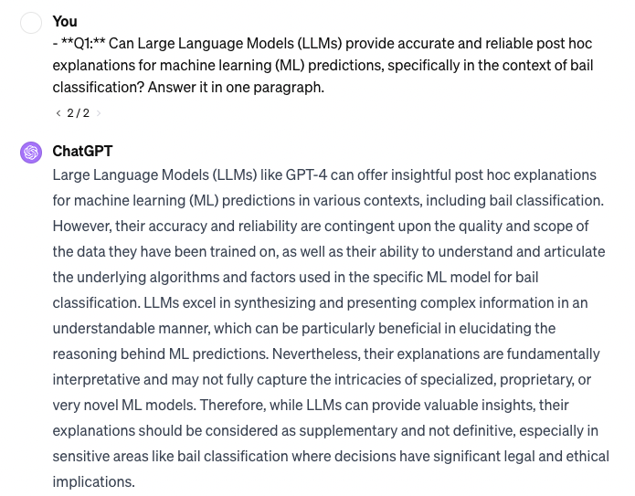

# Title: Exploring the Efficacy of Large Language Models for Post Hoc Explanations in Bail Classification

## Project Information

- **Author**: Zhe Niu, Data Science, Class of 2024, Duke Kunshan University
- **Instructor**: Prof. Luyao Zhang, Duke Kunshan University
- **Disclaimer**: This work is a submission to the Final Project for [ECON211 Intelligent Economics: An Explainable AI Approach 2023 Autumn Term (Seven Week - Second)](https://ms.pubpub.org/) instructed by Prof. Luyao Zhang at Duke Kunshan University.
- **Acknowledgments**: My sincerest appreciation goes to the ECON 211 course and Professor Luyao Zhang for their indispensable guidance and expertise that greatly influenced my research in the field of explainable AI. I also owe gratitude to my peers Enzo Rovira, Yiwei Liang, Jiaolun Zhou, Yi'an Pei, Zakhar Merinov, for their insightful peer reviews and contributions that enriched my academic journey.

- **Project Summary**:
  - **Background/Motivation**:
  - The growing integration of artificial intelligence (AI) in judicial decision-making processes raises crucial questions about the transparency and interpretability of predictive models. The use of risk assessment tools such as the Correctional Offender Management Profiling for Alternative Sanctions (COMPAS) in bail decisions has sparked widespread debate over algorithmic bias and fairness. Consequently, there is an urgent need for explainable AI that can elucidate machine-generated decisions to legal professionals and affected individuals. In this context, Large Language Models (LLMs) such as GPT-3.5 offer promising avenues for generating post hoc explanations that are both accessible and informative.
  - **Research Questions**:
  - **Q1:** Can Large Language Models (LLMs) provide accurate and reliable post hoc explanations for machine learning (ML) predictions, specifically in the context of bail classification?
  - **Q2:** How do LLMs' explanatory capabilities compare with established post hoc explanation methods like SHAP (SHapley Additive exPlanations) and LIME (Local Interpretable Model-agnostic Explanations) in discerning and conveying the key factors that influence bail classification decisions?

- **Answers to research question by ChatGPT**: 

- [Application Scenario](./Method/)
- [Methodology](./Method/)
- [Results](./Method/)
- [Intellectual Merits/Practical Impacts](./Method/)

  
## Table of Contents
- [Literature](./Literature/)
- [Method](./Method/)
- [Data](./Data/)
  -- [queried_data](./Data/queried_data)
  -- [processed_data](./Data/processed_data)
- [Code](./Code/)
  -- [data_query](./Code/data_query)
  -- [data_processing](./Code/data_processing)
  -- [data_analysis](./Code/data_analysis)
- [Results](./Results/)
  -- [Feature_Importance_Data](./Results/Feature_Importance_Data)
- [Spotlights](./Spotlights/)
- [More About the Author](#More-About-the-Author)
- [References](#References)

## Literature

## Method

## Data

## Code

## Results

## Spotlight

## More-About-the-Author

## References
