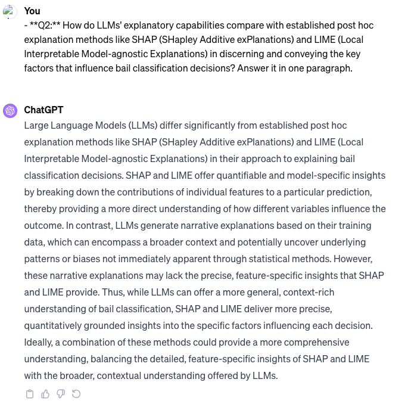

# Title: Exploring the Efficacy of Large Language Models for Post Hoc Explanations in Bail Classification

## Project Information

- **Author**: Zhe Niu, Data Science, Class of 2024, Duke Kunshan University
- **Instructor**: Prof. Luyao Zhang, Duke Kunshan University
- **Disclaimer**: This work is a submission to the Final Project for [ECON211 Intelligent Economics: An Explainable AI Approach 2023 Autumn Term (Seven Week - Second)](https://ms.pubpub.org/) instructed by Prof. Luyao Zhang at Duke Kunshan University.
- **Acknowledgments**: My sincerest appreciation goes to the ECON 211 course and Professor Luyao Zhang for their indispensable guidance and expertise that greatly influenced my research in the field of explainable AI. I also owe gratitude to my peers Enzo Rovira, Yiwei Liang, Jiaolun Zhou, Yi'an Pei, Zakhar Merinov, for their insightful peer reviews and contributions that enriched my academic journey.

- **Project Summary**:
  - **Background/Motivation**:
  - The growing integration of artificial intelligence (AI) in judicial decision-making processes raises crucial questions about the transparency and interpretability of predictive models. The use of risk assessment tools such as the Correctional Offender Management Profiling for Alternative Sanctions (COMPAS) in bail decisions has sparked widespread debate over algorithmic bias and fairness. Consequently, there is an urgent need for explainable AI that can elucidate machine-generated decisions to legal professionals and affected individuals. In this context, Large Language Models (LLMs) such as GPT-3.5 offer promising avenues for generating post hoc explanations that are both accessible and informative.
  - **Research Questions**:
  - **Q1:** Can Large Language Models (LLMs) provide accurate and reliable post hoc explanations for machine learning (ML) predictions, specifically in the context of bail classification?
  - **Q2:** How do LLMs' explanatory capabilities compare with established post hoc explanation methods like SHAP (SHapley Additive exPlanations) and LIME (Local Interpretable Model-agnostic Explanations) in discerning and conveying the key factors that influence bail classification decisions?

- **Answers to research question by ChatGPT**: 

- [Application Scenario](./Method/)
- [Methodology](./Method/)
- [Results](./Method/)
- [Intellectual Merits/Practical Impacts](./Method/)

  
## Table of Contents

- [Literature](./Literature/)
- [Method](./Method/)
- [Data](./Data/)
  - [queried_data](./Data/queried_data)
  - [processed_data](./Data/processed_data)
- [Code](./Code/)
  - [data_query](./Code/data_query)
  - [data_processing](./Code/data_processing)
  - [data_analysis](./Code/data_analysis)
- [Results](./Results/)
  - [Feature_Importance_Data](./Results/Feature_Importance_Data)
- [Spotlights](./Spotlights/)
- [More About the Author](#More-About-the-Author)
- [References](#References)

## Literature

The `Literature` section of this project delves into three key literature streams that underpin the research on Explainable AI (XAI) in the context of bail classification with a focus on Large Language Models (LLMs). It covers:

1. **Explainable AI in Judicial Decision-Making**: Examines methods for explaining black box models, focusing on post hoc techniques like LIME and SHAP, and their importance in judicial contexts.
2. **Application of LLMs in Interpretability**: Explores the integration of LLMs with information retrieval systems and their role in enhancing ML interpretability.
3. **Comparative Studies of Explanation Methods in ML**: Discusses the evaluation of ML explanation quality and compares various post hoc explanation methods, particularly in high-stakes domains.

## Method

The `Method` section of this projectoutlines the methodology for utilizing Large Language Models (LLMs) in Explainable AI (XAI) within the context of judicial decision-making, particularly in bail classification. This section encompasses the entire research process, from the initial motivation and conceptual framework to the practical application scenarios, data processing, model training, explanation generation, and evaluation methods. It emphasizes the use of COMPAS dataset for machine learning model training and LLMs, like GPT-3.5 and GPT-4, for generating explanations. The methodology integrates various ML classifiers (Logistic Regression, SVM, Random Forest) and employs Perturbation-Based In-Context Learning (ICL) for explanation generation. The effectiveness of LLMs in providing interpretable and meaningful explanations is critically assessed through metrics like Feature Agreement (FA) and Rank Agreement (RA), comparing them against traditional post hoc methods like LIME and SHAP. This comprehensive methodological approach aims to enhance transparency and trust in ML decision-making in judicial systems, marking a significant advancement in the field of XAI.

## Data

The `Data` section of this project comprehensively details the handling and structuring of a dataset comprising criminal records and demographic features of 18,876 defendants from U.S. state courts, spanning 1990 to 2009. Derived from the COMPAS recidivism algorithm analysis by ProPublica, this dataset is pivotal for classifying defendants based on bail eligibility. It includes critical features like age, prior crime count, length of stay, charge degree, sex, race, and risk assessment score. The dataset underwent meticulous processing, including filtering, transformation of categorical variables, and ensuring no missing values. It was also strategically split into training (4,937 rows) and testing sets (1,235 rows) for model evaluation. This section not only presents the dataset's structure and transformation but also highlights the importance of ethical considerations in algorithmic decision-making, particularly in assessing recidivism risk and addressing potential biases.

## Code

The `Code` section of this project meticulously details the procedures implemented in the `Data_Query.ipynb`, `Data_Processing.ipynb`, and `Data_Analysis.ipynb` files for managing the COMPAS dataset. Starting with data querying, it involves downloading the dataset from a GitHub URL, initial data inspection, and exporting to a CSV file. The processing phase encompasses filtering criteria, calculating defendants' length of stay, transforming categorical variables, splitting the dataset, and performing exploratory data analysis with visualizations. In the data analysis phase, machine learning models (Logistic Regression, Random Forest, SVM) are implemented, and SHAP and LIME are used for model explanations. It also includes building evaluation metrics like Feature Agreement and Rank Agreement, creating perturbation samples for LLM explanations, and conducting a comparative analysis of results. This section provides a comprehensive overview of the end-to-end process, from data acquisition and preprocessing to advanced analysis and model evaluation, highlighting the project's rigorous and methodical approach to utilizing AI in judicial decision-making.

## Results

The `Results` section presents a thorough analysis of the efficacy of Language Model-based (LLM) post hoc explainers, particularly LLM-GPT-3.5, in comparison to SHAP and LIME, using the COMPAS dataset. Focused on understanding LLMs' capability in generating post hoc explanations for bail classification decisions, the research employs Average Feature Agreement (FA) and Average Rank Agreement (RA) as primary metrics. The results, illustrated in figures 'Performance_Score.png' and 'Performance_Score_parameter.png', reveal the impact of sample size and top K features on explanation fidelity. Key findings include LLM-GPT-3.5's commendable accuracy in identifying important features, although it exhibits variability and lower reliability in ranking them compared to SHAP and LIME. The analysis answers two critical questions: LLMs show potential in providing accurate explanations but still require refinement for consistency and reliability. While LLMs demonstrate potential, especially with fewer top features, SHAP and LIME maintain superior performance in feature identification and ranking, confirming their robustness as post hoc explainers in the field of explainable AI.

## Spotlights

### Project Poster

### Figure of Feature and Rank Agreement across SHAP, LIME, and LLM-GPT-3.5

### Figure of Parameters Impacting FA and RA

### Slides
In the presentation, the poster is used as the slides to show my research process and results.

### Presentations
I have presented my research and the poster during the class. More research details could be found in this GitHub repository.

### Review Articles

In the `Literature` section, we explore three critical literature streams to understand the existing and emerging paradigms in Explainable AI (XAI), particularly in the context of bail classification and Large Language Models (LLMs). The review covers:

1. **Explainable AI in Judicial Decision-Making**: Focuses on methods like LIME and SHAP, highlighting their importance in enhancing transparency in complex ML models in sensitive domains like judicial decision-making.
2. **Application of LLMs in Interpretability**: Investigates the integration of LLMs with information retrieval systems, emphasizing the interpretability aspect of these models.
3. **Comparative Studies of Explanation Methods in ML**: Discusses methods for evaluating the quality of ML explanations, comparing various post hoc explanation methods, particularly in high-stakes domains.

Each stream presents unique insights and sets the foundation for understanding how LLMs can enhance explainability in judicial contexts, contributing new perspectives and methodologies to the field.

### Media Appearance

The inspiration for this research project stems from a growing interest in the potential of Large Language Models (LLMs) as post hoc explainers, as highlighted in recent academic discourse, including a notable paper on Papers with Code titled "Are Large Language Models Post-hoc Explainers?" This paper paves the way for further exploration into the capabilities of LLMs in the domain of Explainable AI (XAI). Recognizing the significance of this emerging area of study, our research aims to contribute to the collective development of LLM applications in XAI. The hope is that this project will not only add to the academic understanding of LLMs as explainers but also encourage more researchers to delve into the exploration and development of LLMs within XAI. This collaborative effort can significantly advance the field, bringing new insights and advancements in making AI more transparent and understandable.

## More-About-the-Author

### Headshot

### Self-introduction

Zhe Niu is a Bachelor of Science in Data Science student at Duke Kunshan University, with an expected graduation in June 2024. He has interned in various prestigious firms in investment management, research, and investment banking sectors in China. His work includes research in the Integrated Circuit industry and equity market analysis. Zhe has co-authored papers for international conferences and led innovative projects like developing an AI-based app for COVID-19 diagnosis. He is skilled in Python, Java, and various data analysis tools, and is fluent in Chinese and English. Zhe's hobbies include music, basketball, and Texas Hold'em.

### Final Reflections
- Intellectual Growth
  
- Professional Growth
  
- Living a Purposeful Life
  
## References
- Literature References in APA Author-Date Style and BibTex
