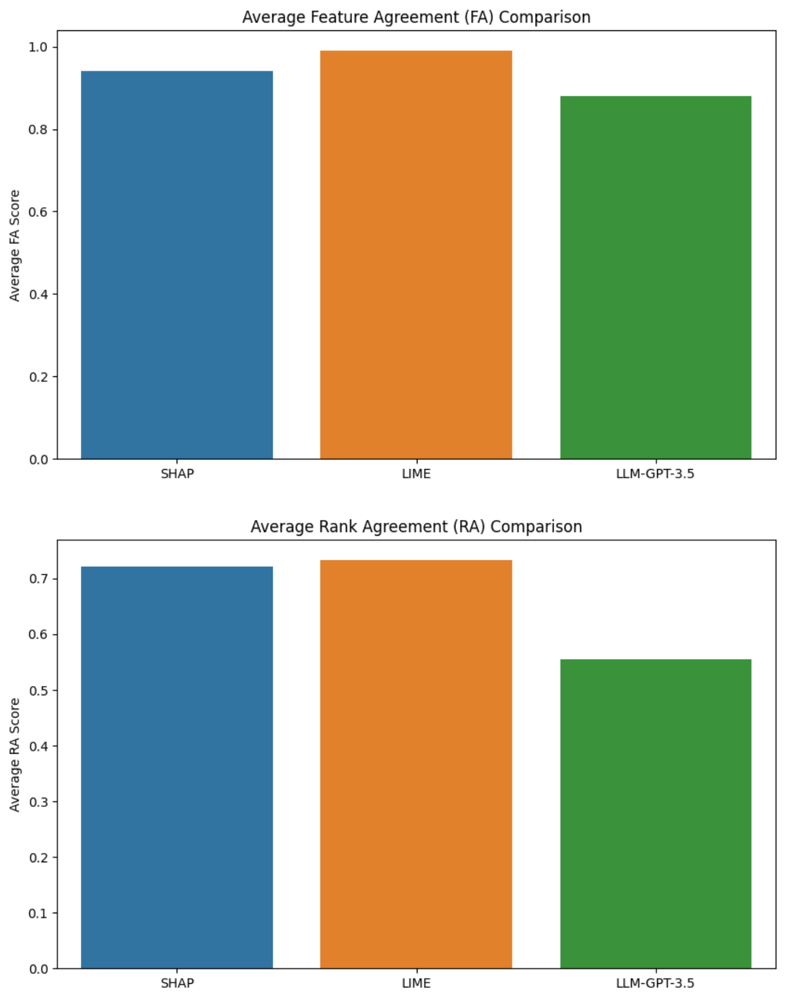
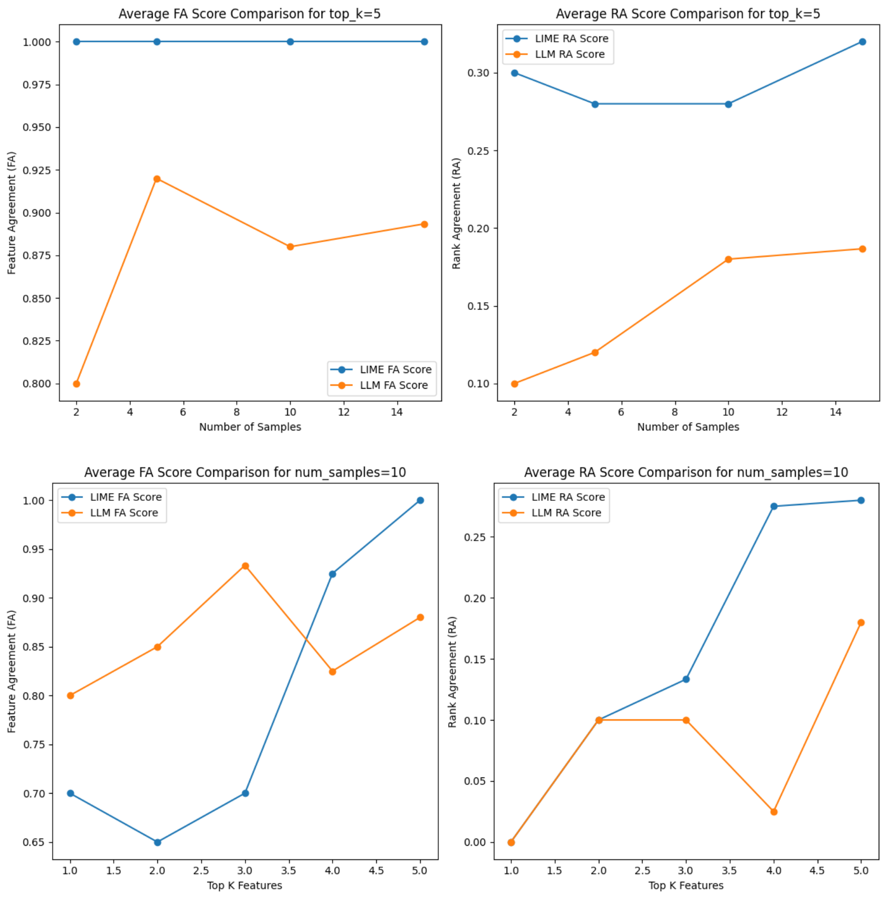

# Results Analysis

## Research Questions Addressed

Our research aimed to answer the following questions using the COMPAS dataset:

- **Q1:** Can LLMs provide accurate and reliable post hoc explanations for ML model predictions?
- **Q2:** How do LLMs compare to existing post hoc explanation methods in identifying key factors influencing bail classification decisions?

### Feature and Rank Agreement across three different methods: SHAP, LIME, and LLM-GPT-3.5

The 'Performance_Score.png' figure shows two bar charts representing the Average Feature Agreement (FA) and Average Rank Agreement (RA) across three different methods: SHAP, LIME, and LLM-GPT-3.5.

- **SHAP:**
  - FA Score: High, indicating a strong agreement in identifying feature importance.
  - RA Score: High, suggesting a reliable ranking of features.
- **LIME:**
  - FA Score: Highest, showing an almost perfect agreement in identifying the correct features.
  - RA Score: Highest, indicating the most reliable ranking among the compared methods.
- **LLM-GPT-3.5:**
  - FA Score: Lower than SHAP and LIME, but still relatively high, showing that LLM can identify important features with good agreement.
  - RA Score: Significantly lower, indicating some challenges in ranking feature importance accurately.

### Parameters Impacting FA and RA

The 'Performance_Score_parameter.png' figure presents line graphs that explore how the number of samples and the top k features impact the FA and RA scores for LIME and LLM methods.

- **Variation with Number of Samples:**
  - **LIME:**
  - Feature Agreement (FA) remains consistently high, approximately 1, indicating stable performance regardless of sample size.
  - Rank Agreement (RA) decreases initially to about 0.28 when the number of samples reaches 10 and then shows an increase, suggesting some variability in ranking performance with different sample sizes.

  - **LLM:**
  - FA is lowest with 2 samples and highest with 4 samples, then tends to decrease as the number of samples increases, indicating a non-linear relationship between sample size and FA.
  - RA consistently improves as the number of samples increases, nearing 0.2 with 15 samples, which implies better performance with more data but still trailing behind LIME.

  - Overall, LIME maintains higher FA and RA scores compared to LLM across varying sample sizes, indicating more stable and reliable explanations.  

- **Variation with Top K Features:**
  - **LLM:**
  - FA outperforms LIME with up to Top 3 Features, showing an increasing trend and peaking at Top 3 before declining, suggesting a strong performance in identifying a small number of important features.
  - RA does not show a clear trend, with lower scores at Top 1 and Top 4 Features, overall lower than LIME's RA scores.

  - **LIME:**
  - Both FA and RA scores trend upwards, with both metrics peaking at Top 5 Features, indicating robust identification and ranking of feature importance as more features are considered.

  - The data suggests LLM provides better FA when considering a smaller set of top features, whereas LIME shows stronger and more consistent performance as the number of top features increases.

## Responses to Research Questions

- **Q1:** Can LLMs provide accurate and reliable post hoc explanations for ML model predictions?
- **Q1 Response:**
- LLM-GPT-3.5 shows the capability to generate fairly accurate explanations with an FA of 0.88, which is commendable for a black-box model.  However, when considering the variability of FA across different numbers of samples, it becomes evident that LLM-GPT-3.5's performance may not be consistent across different contexts.  The RA score of 0.55 for LLMs, while significantly lower than that of SHAP (0.72) and LIME (0.73), still indicates a moderate understanding of feature importance.  This suggests that while LLMs are capable of providing accurate explanations, especially for a smaller set of key features, there is room for improvement in consistency and reliability.

- **Q2:** How do LLMs compare to existing post hoc explanation methods in identifying key factors influencing bail classification decisions?
- **Q2 Response:**
- Compared to SHAP and LIME, LLM-GPT-3.5 demonstrates a potential in identifying key factors influencing bail classification decisions, particularly with a smaller number of top features, where it even outperforms LIME.  However, the overall FA and RA scores for LIME are superior to those of LLM-GPT-3.5, particularly as the number of top features increases.  This is consistent with the high FA score of 0.99 for LIME, indicating an almost perfect feature identification capability.  SHAP also shows strong performance with an FA of 0.94 and the highest RA among the three methods, reinforcing its reliability in ranking features.  These observations confirm the robustness of LIME as a post hoc explainer and suggest that SHAP remains a reliable method for both feature identification and ranking.  In light of these results, LLMs, although effective, may require further refinement to achieve the level of faithfulness provided by established methods like SHAP and LIME.

## Conclusion

- In conclusion, our analysis of the COMPAS dataset through the lens of post hoc explanations has yielded insightful findings about the capabilities of LLMs, particularly LLM-GPT-3.5, compared to established methods like SHAP and LIME. 

- The evidence presented through the 'Performance_Score.png' and 'Performance_Score_parameter.png' figures indicates that while LLM-GPT-3.5 can generate accurate explanations to a certain extent, it still falls short of the consistency and reliability demonstrated by SHAP and LIME. This is most notable in the context of FA and RA scores, where LLM-GPT-3.5's performance is variable, depending on the number of features and samples considered. 

- LLM-GPT-3.5 displays potential, especially when focusing on a small number of top features, suggesting that LLMs have a place in the realm of explainable AI. However, the superior FA and RA scores of LIME across the board, along with SHAP's robustness in ranking feature importance, show that these traditional methods still lead in providing comprehensive and reliable post hoc explanations. 

- Therefore, while LLMs are a promising avenue for generating explanations for ML model predictions, there is a clear need for further research and development to refine their application. This will ensure that LLMs not only maintain high accuracy when identifying key features but also improve in consistently ranking them, ultimately achieving a level of faithfulness on par with or exceeding current methods.

